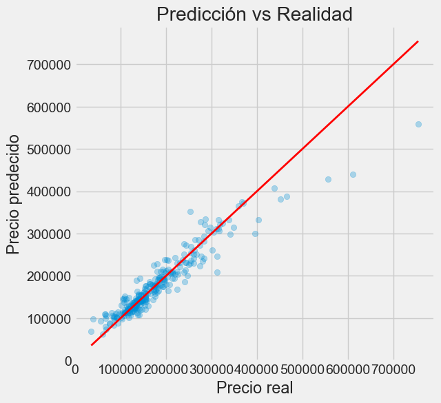

### 📘 Estructura del README.md para tu proyecto de predicción de precios de casas

Aquí tienes un borrador completo y limpio que puedes personalizar:

```markdown
# 🏡 Predicción de precios de casas - Kaggle House Prices

Este proyecto usa técnicas de Machine Learning para predecir el precio de casas a partir de datos del famoso concurso de Kaggle ["House Prices: Advanced Regression Techniques"](https://www.kaggle.com/competitions/house-prices-advanced-regression-techniques/).

## 📂 Estructura del proyecto


📦 house-prices-regression
│
├── data/
│   ├── train.csv
│   └── test.csv
│
├── notebooks/
│   └── analysis.ipynb
│
├── models/
│   └── best\_model.pkl
│
├── submission.csv
├── requirements.txt
└── README.md

````

## ⚙️ Tecnologías utilizadas

- Python 3.10+
- Pandas y Numpy para manipulación de datos
- Scikit-Learn para preprocesamiento, modelado y validación
- Seaborn y Matplotlib para visualización
- Random Forest, Ridge y Lasso como modelos principales

## 🚀 Pasos realizados

1. **Análisis exploratorio:** manejo de valores nulos, outliers y distribución de precios.
2. **Preprocesamiento:** imputación, codificación y escalado de variables.
3. **Evaluación de modelos:** validación cruzada con métricas como RMSE.
4. **Optimización:** búsqueda de hiperparámetros con `RandomizedSearchCV`.
5. **Predicción final:** sobre el conjunto de test y generación del archivo `submission.csv`.

## 🧠 Resultados


Modelo con mejor desempeño:
- **Random Forest Regressor**
- **RMSE (validación cruzada):** ~31025
## Recta Y



## 📝 Cómo usar este repositorio

1. Clona el repositorio:
   ```bash
   git clone https://github.com/TU_USUARIO/nombre-proyecto.git
   cd nombre-proyecto
````

2. Crea un entorno virtual (opcional pero recomendado):

   ```bash
   python -m venv venv
   source venv/bin/activate  # En Windows usa: venv\Scripts\activate
   ```

3. Instala las dependencias:

   ```bash
   pip install -r requirements.txt
   ```

4. Ejecuta los notebooks o scripts:

   ```bash
   jupyter notebook
   ```

## ✍️ Autor

* Andrés Felipe Lemus Victoria
* Proyecto realizado como parte del aprendizaje de ciencia de datos
